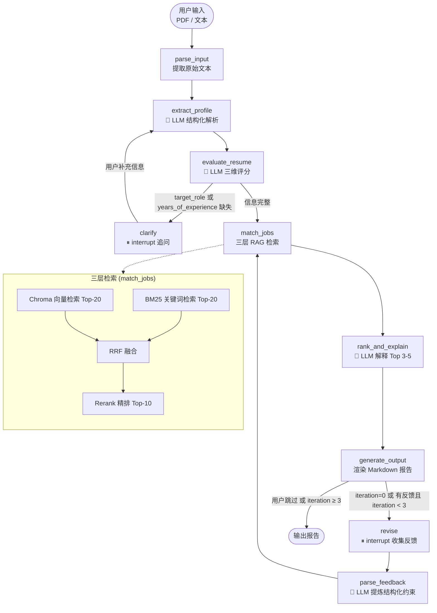

# CareerCopilot

> 基于 LangGraph 的智能简历评估与职位推荐系统

CareerCopilot 接收 PDF 或文本格式的简历，通过 LLM 提取结构化档案、多维度评分，再经由三层 RAG 检索从职位库中精准匹配岗位，最终生成包含匹配理由和差距分析的 Markdown 报告。全程内置两处 **Human-in-the-loop** 交互节点，配合 **MemorySaver Checkpointer** 实现状态持久化，支持异步中断恢复与多轮反馈闭环。

---

## 架构图



---

## 部署形态

本仓库为**本地开发版**，使用 Chroma + 500 条 demo 数据，目的是零依赖一键跑通完整 Agent 链路，方便阅读与二次开发。

| | 本地开发版（本仓库） | 生产部署版 |
|---|---|---|
| 向量库 | Chroma（本地持久化） | Elasticsearch Hybrid Search |
| 数据规模 | 500 条 demo 岗位 | 原始 500 万+ → 清洗去重后索引 220 万+ |
| 数据源 | `jobs/jobs.json` 示例 | BOSS、智联招聘、前程无忧等多渠道 |
| Checkpointer | `MemorySaver`（进程内存） | 可替换为 SQLite / Postgres backend |
| 交互形态 | CLI + `interrupt()` 阻塞读取 stdin | Web API + 异步 `Command(resume=)` 回调 |

**生产环境性能（同一测试集，人工标注 ground truth）**：

- 单次端到端检索（向量 + BM25 + RRF + Rerank）耗时 < 500ms（P95）
- Top-10 命中率（Recall@10）相对单路向量召回基线 **+12%**
- 累计服务活跃用户 3579 名，处理简历分析请求 2655 次

得益于检索层的可插拔抽象与 `interrupt()` / `Command(resume=)` 的状态机设计，从本地版迁移到生产版**只需替换检索后端实现与 checkpointer backend，Agent 主流程零改动**。

---

## 核心特性

| 特性 | 实现方式 |
|------|----------|
| **Human-in-the-loop** | LangGraph `interrupt()` — 暂停时将完整 state 序列化进 checkpointer，`Command(resume=)` 恢复执行 |
| **状态持久化** | `MemorySaver` checkpointer + `thread_id` — 每次 interrupt 自动快照 state，支持跨调用恢复 |
| 条件路由 | `should_clarify` / `after_clarify` / `human_feedback_router` — 根据字段完整度和反馈状态动态分叉 |
| 三层 RAG | Chroma 向量 + BM25 关键词 → RRF 融合 → Rerank 精排，各层互补 |
| 反馈闭环 | 用户自然语言 → `parse_feedback` 结构化约束 → 重新检索，iteration ≤ 3 防死循环 |
| 凭证隔离 | `.env` 管理所有 API Key，`config.py` 只暴露常量，各节点独立实例化 LLM |

---

## Human-in-the-loop 与状态持久化

这是本项目最核心的设计——**Agent 不是一条直通管线，而是可中断、可恢复、可多轮交互的有状态系统。**

### 为什么用 `interrupt()` 而不是 `input()`

| | `input()`（普通阻塞） | `interrupt()`（LangGraph 原生） |
|---|---|---|
| 暂停时状态 | 丢失，进程内存中 | **自动快照到 checkpointer** |
| 恢复方式 | 只能从头重跑 | `Command(resume=answer)` 从中断点继续 |
| 跨进程恢复 | ❌ 不支持 | ✅ 同 `thread_id` 即可恢复 |
| 扩展为 Web/API | ❌ 不可能 | ✅ 天然支持异步回调 |

### 两处 interrupt 节点

**`clarify`** — 简历关键信息缺失时追问：

```python
# nodes/clarify.py
answer = interrupt({
    "message": "请回答以下问题以便更准确地为您推荐职位：",
    "questions": questions,
})
# 恢复后 answer 即为用户输入，注入 state["clarify_answers"]
```

**`revise`** — 生成报告后征集调整意见：

```python
# nodes/revise.py
result = interrupt({
    "message": "对以上推荐结果是否有调整意见？",
    "current_report": state.get("final_report", ""),
})
# 恢复后 result 注入 state["user_feedback"]，iteration +1
```

### Checkpointer 状态持久化机制

```python
# main.py — 核心执行逻辑
checkpointer = MemorySaver()                          # ① 内存级 checkpointer
graph = build_graph(checkpointer=checkpointer)         # ② 编译时注入

thread_id = str(uuid.uuid4())
config = {"configurable": {"thread_id": thread_id}}    # ③ 每次会话独立 thread

result = graph.invoke(initial_state, config=config)    # ④ 首次运行 → 遇到 interrupt 自动快照

# ... 读取 interrupt payload，收集用户输入 ...

result = graph.invoke(Command(resume=answer), config=config)  # ⑤ 从快照恢复，注入 answer，继续执行
```

**工作流程**：

1. `graph.invoke()` 运行到 `interrupt()` → **自动暂停**，将完整 `ResumeState` 快照写入 checkpointer
2. `main.py` 从 `graph.get_state(config)` 读取 interrupt payload，展示给用户
3. 用户输入后，`Command(resume=answer)` 从 **快照恢复** 整个 state，把 answer 传回中断节点继续执行
4. 遇到下一个 `interrupt()` → 重复 1-3
5. 无 interrupt → graph 运行到终点，`get_state(config).values` 包含完整最终 state

### 条件路由控制循环

```python
# graph.py
def human_feedback_router(state: ResumeState) -> str:
    iteration = state.get("iteration", 0)
    feedback  = state.get("user_feedback", "").strip()

    if iteration == 0:          # 首次：还没征求反馈，必须进入 revise
        return "revise"
    if feedback and iteration < 3:  # 后续：有实质反馈 → 循环重检索
        return "revise"
    return END                  # 用户跳过 或 达到上限 → 结束
```

这意味着用户可以 **多次调整检索方向**（换城市、排除某类公司、调薪资），每次反馈都经 `parse_feedback` 提炼为结构化约束，重新执行完整三层 RAG 检索。

---

## 项目结构

```
CareerCopilot/
├── main.py                  # CLI 入口，interrupt 事件循环 + Command(resume)
├── graph.py                 # LangGraph StateGraph 定义 + 条件路由
├── state.py                 # ResumeState TypedDict — Agent 全局状态
├── config.py                # 凭证常量 + Embedding 单例
├── .env.example             # 环境变量模板
├── requirements.txt
│
├── nodes/
│   ├── parse_input.py       # PDF / 文本解析（pymupdf）
│   ├── extract_profile.py   # 结构化简历解析（LLM）
│   ├── evaluate_resume.py   # 三维度评分（LLM）
│   ├── clarify.py           # ⏸ 追问缺失信息（interrupt + MemorySaver）
│   ├── match_jobs.py        # 三层 RAG 检索
│   ├── rank_and_explain.py  # 匹配理由 + 差距分析（LLM）
│   ├── generate_output.py   # Markdown 报告生成
│   ├── revise.py            # ⏸ 收集用户反馈（interrupt + MemorySaver）
│   └── parse_feedback.py    # 反馈 → 结构化约束（LLM）
│
├── prompts/
│   ├── extract_profile.txt
│   ├── evaluate_resume.txt
│   ├── rank_and_explain.txt
│   └── parse_feedback.txt
│
├── jobs/
│   └── jobs.json            # 职位数据库（500 条）
│
├── scripts/
│   ├── csv_to_json.py       # 原始 CSV → jobs.json
│   └── build_index.py       # 构建 Chroma + BM25 索引
│
└── index/                   # 本地索引（gitignore，需本地构建）
    ├── chroma/
    └── bm25.pkl
```

---

## 快速开始

### 1. 安装依赖

```bash
pip install -r requirements.txt
```

### 2. 配置环境变量

```bash
cp .env.example .env
# 编辑 .env，填入你的 API Key
```

`.env` 模板：

```
# LLM（支持任意 OpenAI 兼容 API）
LLM_BASE_URL=https://dashscope.aliyuncs.com/compatible-mode/v1
LLM_API_KEY=your_api_key_here

# Embedding
EMBEDDING_BASE_URL=https://dashscope.aliyuncs.com/compatible-mode/v1
EMBEDDING_API_KEY=your_api_key_here
EMBEDDING_MODEL=text-embedding-v4

# Rerank（DashScope 原生 API，非 OpenAI 兼容格式）
RERANK_BASE_URL=https://dashscope.aliyuncs.com/api/v1/services/rerank/text-rerank/text-rerank
RERANK_API_KEY=your_api_key_here
RERANK_MODEL=qwen3-rerank
```

> 默认使用阿里云 DashScope。LLM 和 Embedding 走 OpenAI 兼容接口，Rerank 起原生 HTTP API（请求体为嵌套 `input/parameters` 格式）。任何支持 OpenAI 格式的 API 均可接入 LLM/Embedding，修改 `base_url` 即可。

### 3. 准备职位数据 & 构建索引

```bash
# 如已有 jobs/jobs.json，直接构建索引：
python scripts/build_index.py

# 如需从 CSV 转换：
python scripts/csv_to_json.py
python scripts/build_index.py
```

### 4. 运行

```bash
# PDF 简历
python main.py resume.pdf

# 文本粘贴（输入完成后输入 END 结束）
python main.py --text
```

运行节点流程：

```
── 开始分析简历 ──

[1/5] 解析简历文件...
[2/5] 提取简历结构（LLM 调用中）...
[3/5] 评估简历质量（LLM 调用中）...
[4/5] 检索匹配职位（向量 + BM25 + Rerank）  [迭代 #0]
  [检索Query] 数据分析师 Python SQL 机器学习...
  [规则过滤] 工作年限≤3, 城市=不限, 最低薪资=不限, 排除行业=无
  [规则过滤] 原始职位 500 → 过滤后 480
  [向量检索] 命中 20 条
  [BM25检索] 命中 20 条
  [RRF融合] 向量20 + BM2520 → 融合 28 条
  [Rerank] 候选 20 → 精排 10
    1. 数据分析师  (score=0.92)
    2. BI工程师    (score=0.85)
    ...
[5/5] 排序并生成推荐理由（LLM 调用中）...

══════════════════════════════════════
# CareerCopilot 职业报告 — 某某
══════════════════════════════════════

对以上推荐结果是否有调整意见？（例如：不要外企 / 只看深圳 / 薪资要求 20K 以上）
您的意见：只看深圳的岗位，薪资15K以上

[4/5] 检索匹配职位（向量 + BM25 + Rerank）  [迭代 #1]
  [规则过滤] 工作年限≤3, 城市=深圳, 最低薪资=15000, 排除行业=无
  [规则过滤] 原始职位 500 → 过滤后 35
  ...
```

---

## 技术栈

| 层 | 技术 |
|----|------|
| Agent 框架 | LangGraph 1.2 |
| 状态持久化 | LangGraph `MemorySaver` checkpointer + `interrupt()` / `Command(resume=)` |
| LLM 接入 | LangChain-OpenAI（兼容任意 OpenAI 格式 API） |
| 向量数据库 | Chroma（本地持久化，零服务器） |
| 关键词检索 | rank-bm25 |
| 检索融合 | RRF（Reciprocal Rank Fusion） |
| Rerank | DashScope qwen3-rerank（原生 HTTP API，可替换） |
| PDF 解析 | PyMuPDF |

---

## 设计

**1. interrupt() + MemorySaver：有状态的 Human-in-the-loop**

`clarify` 和 `revise` 两个节点使用 LangGraph `interrupt()` 暂停执行。暂停时，`MemorySaver` checkpointer 自动将完整 `ResumeState` 快照持久化。恢复时，`Command(resume=answer)` 从快照重建 state 并把用户输入注入中断节点。

这套机制的关键优势：
- **可恢复**：同一 `thread_id` 下任意时刻可恢复，无需从头重跑
- **可扩展**：CLI → Web API 只需把 interrupt 换成异步回调，checkpointer 换成数据库后端即可
- **有状态**：反馈循环中的 `iteration`、`constraints`、`user_feedback` 都随快照自动保留

**2. 两阶段检索**

第一阶段（召回）：Chroma 向量检索 + BM25 关键词检索，两路 Top-20 经 RRF 融合——向量擅长语义匹配，BM25 擅长精确关键词，互为补充。

第二阶段（精排）：Rerank 模型对融合结果重新打分，精准度显著高于单纯余弦相似度。

**3. 反馈闭环重检索**

用户反馈不只是过滤解释层，而是经 `parse_feedback` 提炼为结构化约束（城市、薪资下限、排除公司类型等），注入 `match_jobs` 重新执行完整三层检索。反馈真正影响候选池，而非只改变呈现。每次迭代 RAG 步骤都会打印 debug 日志（query、规则过滤、向量/BM25 命中数、Rerank 排名），方便对比前后变化。

**4. 条件路由防死循环**

`human_feedback_router` 三段逻辑：
- `iteration == 0` → 必须进入 `revise`（首次还没有征求反馈）
- 有实质反馈 + `iteration < 3` → 循环重检索
- 用户跳过 或 `iteration ≥ 3` → 直接结束

---

## License

MIT
