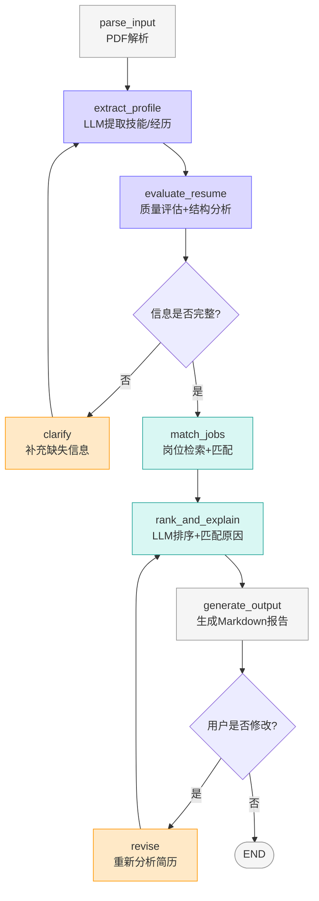

项目架构图

```mermaid
flowchart TD

    A[parse_input<br/>PDF解析] --> B[extract_profile<br/>LLM提取技能/经历]

    B --> C[evaluate_resume<br/>质量评估+结构分析]

    C --> D{信息是否完整?}

    D -- 否 --> E[clarify<br/>补充缺失信息]
    E --> B

    D -- 是 --> F[match_jobs<br/>岗位检索+匹配]

    F --> G[rank_and_explain<br/>LLM排序+匹配原因]

    G --> H[generate_output<br/>生成Markdown报告]

    H --> I{用户是否修改?}

    I -- 是 --> J[revise<br/>重新分析简历]
    J --> G

    I -- 否 --> K([END])

    classDef analysis fill:#dcd8ff,stroke:#6c63ff;
    classDef matching fill:#d9f7f3,stroke:#26a69a;
    classDef human fill:#ffe9c7,stroke:#ff9800;
    classDef io fill:#f5f5f5,stroke:#999;

    class A,H,K io;
    class B,C analysis;
    class F,G matching;
    class E,J human;
```
