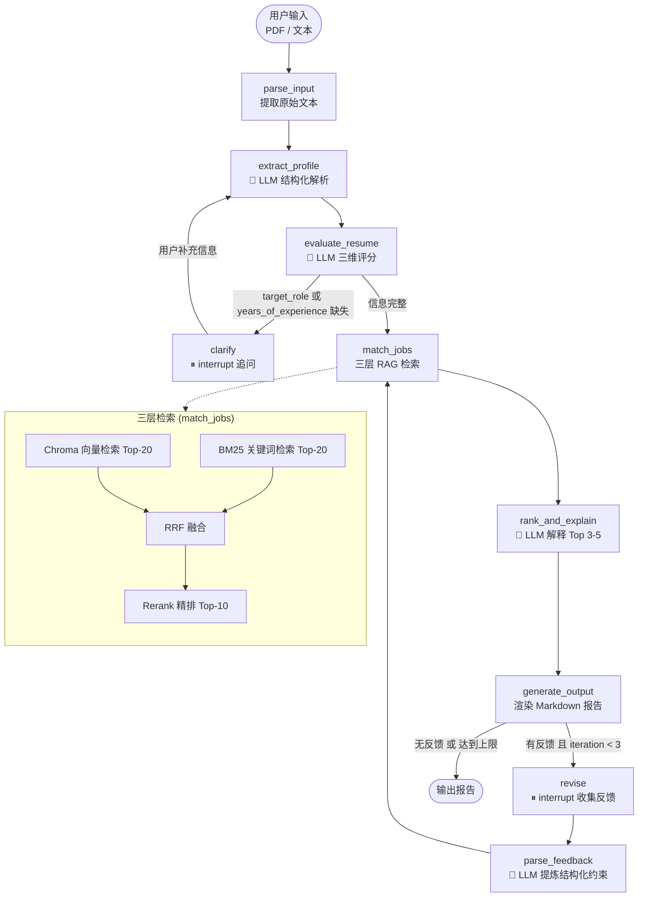

# CareerCopilot

> 基于 LangGraph 的智能简历评估与职位推荐系统

CareerCopilot 接收 PDF 或文本格式的简历，通过 LLM 提取结构化档案、多维度评分，再经由三层 RAG 检索从职位库中精准匹配岗位，最终生成包含匹配理由和差距分析的 Markdown 报告。全程内置两处 Human-in-the-loop 交互节点，支持用户随时介入修正和调整。

---

## 架构图



---

## 核心特性

| 特性 | 实现方式 |
|------|----------|
| Human-in-the-loop | LangGraph `interrupt()` — 支持状态持久化与异步恢复，优于简单 `input()` |
| 条件路由 | `should_clarify`：profile 缺关键字段则追问，否则直接检索 |
| 三层 RAG | Chroma 向量 + BM25 关键词 → RRF 融合 → Rerank 精排，各层互补 |
| 反馈闭环 | 用户自然语言反馈 → `parse_feedback` 结构化 → 重新检索，iteration 上限 3 次防死循环 |
| 凭证隔离 | `.env` 管理所有 API Key，`config.py` 只暴露常量，各节点独立实例化 LLM |

---

## 项目结构

```
CareerCopilot/
├── main.py                  # CLI 入口，interrupt 事件循环
├── graph.py                 # LangGraph StateGraph 定义
├── state.py                 # ResumeState TypedDict
├── config.py                # 凭证常量 + Embedding 单例
├── .env.example             # 环境变量模板
├── requirements.txt
│
├── nodes/
│   ├── parse_input.py       # PDF / 文本解析（pymupdf）
│   ├── extract_profile.py   # 🤖 结构化简历解析
│   ├── evaluate_resume.py   # 🤖 三维度评分
│   ├── clarify.py           # ⏸ 追问缺失信息（interrupt）
│   ├── match_jobs.py        # 三层 RAG 检索
│   ├── rank_and_explain.py  # 🤖 匹配理由 + 差距分析
│   ├── generate_output.py   # Markdown 报告生成
│   ├── revise.py            # ⏸ 收集用户反馈（interrupt）
│   └── parse_feedback.py    # 🤖 反馈 → 结构化约束
│
├── prompts/
│   ├── extract_profile.txt
│   ├── evaluate_resume.txt
│   ├── rank_and_explain.txt
│   └── parse_feedback.txt
│
├── jobs/
│   └── jobs.json            # 职位数据库（500 条）
│
├── scripts/
│   ├── csv_to_json.py       # 原始 CSV → jobs.json
│   └── build_index.py       # 构建 Chroma + BM25 索引
│
└── index/                   # 本地索引（gitignore，需本地构建）
    ├── chroma/
    └── bm25.pkl
```

---

## 快速开始

### 1. 安装依赖

```bash
pip install -r requirements.txt
```

### 2. 配置环境变量

```bash
cp .env.example .env
# 编辑 .env，填入你的 API Key
```

`.env` 模板：

```
LLM_BASE_URL=https://dashscope.aliyuncs.com/compatible-mode/v1
LLM_API_KEY=your_api_key_here

EMBEDDING_BASE_URL=https://dashscope.aliyuncs.com/compatible-mode/v1
EMBEDDING_API_KEY=your_api_key_here
EMBEDDING_MODEL=text-embedding-v4

RERANK_BASE_URL=https://dashscope.aliyuncs.com/compatible-mode/v1
RERANK_API_KEY=your_api_key_here
RERANK_MODEL=qwen3-vl-rerank
```

> 默认使用阿里云 DashScope OpenAI 兼容接口。任何支持 OpenAI 格式的 API 均可接入，修改 `base_url` 即可。

### 3. 准备职位数据 & 构建索引

```bash
# 如已有 jobs/jobs.json，直接构建索引：
python scripts/build_index.py

# 如需从 CSV 转换：
python scripts/csv_to_json.py
python scripts/build_index.py
```

### 4. 运行

```bash
# PDF 简历
python main.py resume.pdf

# 文本粘贴（输入完成后输入 END 结束）
python main.py --text
```

---

## 技术栈

| 层 | 技术 |
|----|------|
| Agent 框架 | LangGraph 1.2 |
| LLM 接入 | LangChain-OpenAI（兼容任意 OpenAI 格式 API） |
| 向量数据库 | Chroma（本地持久化，零服务器） |
| 关键词检索 | rank-bm25 |
| 检索融合 | RRF（Reciprocal Rank Fusion） |
| Rerank | qwen3-vl-rerank（阿里云，可替换） |
| PDF 解析 | PyMuPDF |
| 状态持久化 | LangGraph MemorySaver |

---

## 设计亮点（面试要点）

**1. interrupt() vs input()**

`clarify` 和 `revise` 节点使用 LangGraph `interrupt()` 而非普通 `input()`。`interrupt()` 在暂停时将完整 state 序列化进 checkpointer，支持跨进程/异步恢复；`input()` 则是阻塞调用，无法持久化。这使系统具备扩展为 Web 服务的基础架构。

**2. 两阶段检索**

第一阶段（召回）：Chroma 向量检索 + BM25 关键词检索，两路 Top-20 经 RRF 融合——向量擅长语义匹配，BM25 擅长精确关键词，互为补充。

第二阶段（精排）：Rerank 模型对融合结果重新打分，精准度显著高于单纯余弦相似度。

**3. 反馈闭环重检索**

用户反馈不只是过滤解释层，而是经 `parse_feedback` 提炼为结构化约束（城市、薪资下限、排除公司类型等），注入 `match_jobs` 重新执行完整三层检索。反馈真正影响候选池，而非只改变呈现。

**4. iteration 防死循环**

`human_feedback_router` 检查 `state.iteration < 3`，超过上限直接输出，防止用户无限循环修改。

---

## License

MIT
